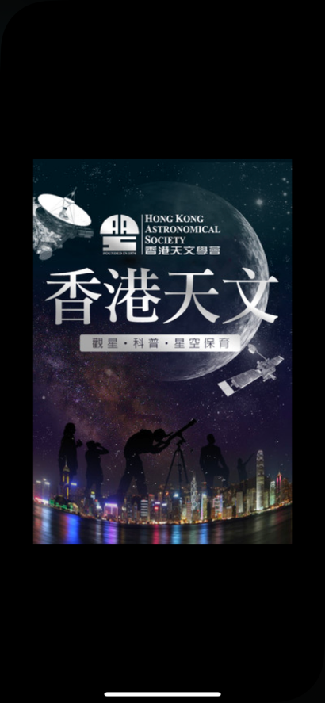
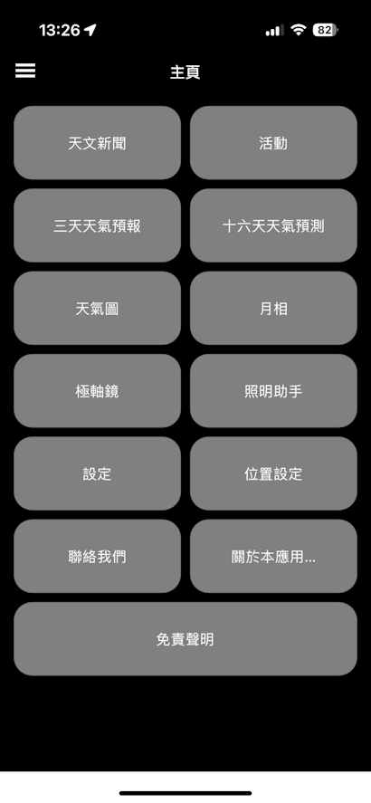
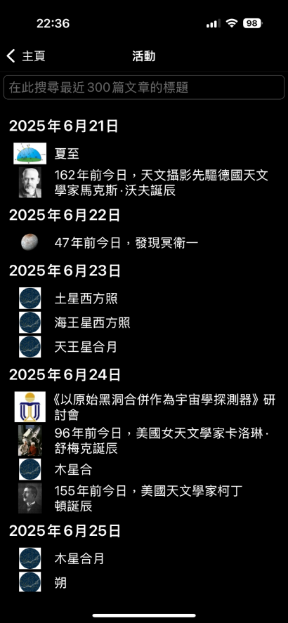

    

# 香港天文 (HKAStro)
本手機應用程式由香港天文學會提供，旨在為用戶提供最新的本地天文新聞、活動、天氣預報資訊，並提供極軸鏡、月相、照明助手等實用功能。

# 手機應用程式需求
1. Android系統需求最低6.0，位置設定頁面地圖需要GMS才可以使用
2. iOS或iPadOS系統需求最低13.0

# 下載鏈結
iOS版: (https://香港天文.香港/ios)

Android版: (https://香港天文.香港/android) 或從本儲存庫 (Repository) 的Release頁面下載APK檔

# 更新日誌
- 2025/6/23: 2.8.1 Beta 1
  1. 天文新聞、天文活動、三天天氣預報、十六天天氣預報、月相圖、極軸鏡視圖及天氣圖頁面新增下拉式更新功能
  2. 天文新聞、天文活動頁面支援自動完成
  3. 天氣圖現在跟隨自定位置（如已經設定）或目前位置更新，以該位置的時區（含夏令時）顯示
  4. 修正月相圖顯示問題，並使用新的北極星計算式
  5. 重寫代碼，修復錯誤並提高效能
  6. 加入免責聲明

# 開放部分源碼
此手機應用以C#編寫，為.NET 9.0 MAUI專案，現開放一部分源碼。
開放的源碼以AGPL 3.0許可證發佈，可於本儲存庫的OpenSourced目錄下載。
使用部分或全部該源碼將視為接受本許可證。

# 手機應用程式截圖 
  
  
  
 
